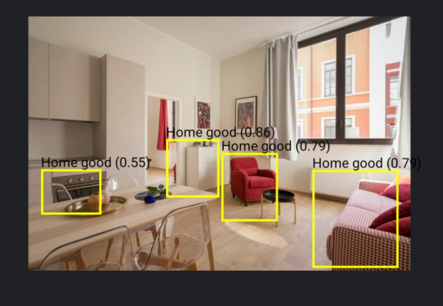

# ti.mlkit.objectdetection - MLKit object detection for Titanium SDK (Android)

 
Detecting objects in images using MLKit (https://developers.google.com/ml-kit/vision/object-detection)

## Methods

* detect({image: blob})

## Events

* detected

## Example

check example/app.js for a full example
